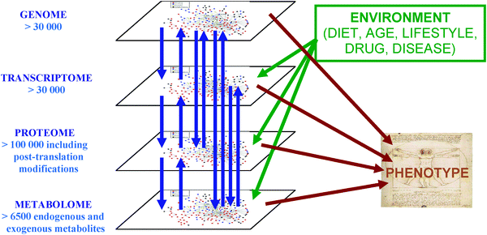

# Introduction

Information in living organism commuicates along the Central Dogma in different scales from individual, population, community to ecosystem. Metabolomics (i.e., the profiling and quantitation of metabolites) is a relatively new field of "omics" studies. Different from other omics studies, metabolomics always focused on small moleculars with much lower mass than polypeptide with single or doubled charged ions. Here is a demo of the position of metabolomics in "omics" studies[@b.dunn2011].

```{r metaintro, fig.show='hold', fig.cap='The complex interactions of functional levels in biological systems.',echo=FALSE,out.width='90%'}

```

Metabolomics studies always employ GC-MS[@theodoridis2012], GC*GC-MS[@tian2016], LC-MS[@gika2014], LC-MS/MS[@begou2017] or NMR[@zhang2012a;@b.dunn2011] to measure metabolites. However, this workflow will only cover mass spectrometry based metabolomics or XC-MS based research.

## History

### History of Mass Spectrometry

- 1913, Sir Joseph John Thomson "Rays of Positive Electricity and Their Application to Chemical Analyses."

```{r history, fig.show='hold', fig.cap='Sir Joseph John Thomson "Rays of Positive Electricity and Their Application to Chemical Analyses."',echo=FALSE,out.width='90%'}
knitr::include_graphics('images/mshistory.jpg')
```

- Petroleum industry bring mass spectrometry from physics to chemistry

- The first commercial mass spectrometer is from Consolidated Engineering Corp to analysis simple gas mixtures from petroleum

- In World War II, U.S. use mass spectrometer to separate and enrich isotopes of uranium in Manhattan Project

- U.S. also use mass spectrometer for organic compounds during wartime and extend the application of mass spectrometer

- 1946, TOF, William E. Stephens

- 1970s, quadrupole mass analyzer

- 1970s, R. Graham Cooks developed mass-analyzed ion kinetic energy spectrometry, or MIKES to make MRM analysis for multi-stage mass sepctrometry

- 1980s, MALDI rescue TOF and mass spectrometry move into biological application

- 1990s, Orbitrap mass spectrometry

- 2010s, Aperture Coding mass spectrometry

### History of Metabolomcis

According to this book section[@kusonmano2016]:

```{r history2, fig.show='hold', fig.cap='Metabolomics timeline during pre- and post-metabolomics era',echo=FALSE,out.width = '90%'}
knitr::include_graphics('images/metahistory.jpg')
```

- 2000-1500 BC some traditional Chinese doctors who began to evaluate the glucose level in urine of diabetic patients using ants

- 300 BC ancient Egypt and Greece that traditionally determine the urine taste to diagnose human diseases

- 1913 Joseph John Thomson and Francis William Aston mass spectrometry 

- 1946 Felix Bloch and Edward Purcell Nuclear magnetic resonance

- late 1960s chromatographic separation technique

- 1971 Pauling’s research team "Quantitative Analysis of Urine Vapor and Breath by Gas–Liquid Partition Chromatography"

- Willmitzer and his research team pioneer group in metabolomics which suggested the promotion of the metabolomics field and its potential applications from agriculture to medicine and other related areas in the biological sciences

- 2007 Human Metabolome Project consists of databases of approximately 2500 metabolites, 1200 drugs, and 3500 food components

- post-metabolomics era high-throughput analytical techniques 

### Defination

Metabolomics is actually a comprehensive analysis with identification and quantification of both known and unknown compounds in an unbiased way. Metabolic fingerprinting is working on fast classification of samples based on metabolite data without quantifying or identification of the metabolites. Metabolite profiling always need a pre-defined metabolites list to be quantification[@madsen2010]. However, targeted and untargeted metabolomics are also used in publicaitons. A similar concept called non-targeted analysis/screen is actually describe the similar studies or workflow.  

## Reviews and tutorials

Some nice reviews and tutorials related to this workflow could be found in those papers or directly online:

### Workflow

Those papers are recommended[@barnes2016a; @cajka2016; @lu2008; @fiehn2002] for general metabolomics related topics. For targeted metaabolomics, you could check those reviews[@begou2017; @zhou2016; @lu2008a; @weljie2006; @yuan2012; @griffiths2010].

### Data analysis

You could firstly read those papers[@barnes2016; @alonso2015; @kusonmano2016; @madsen2010; @uppal2016] to get the concepts and issues for data analysis in metabolomics. Then this paper[@gromski2015] could be treated as a step-by-step tutorial.

- For annotation, this paper[@domingo-almenara2018] is an well organized review.

- For database used in metabolomics, you could check this review[@vinaixa2016]. 
- For metabolomics software, check this series of reviews for each year[@misra2016; @misra2017; @misra2018]. 

- For open sourced software, this review[@spicer2017] could be a good start.

- For DIA or DDA metabolomics, check those papers[@bilbao2015; @fenaille2017].

Here is the slides for metabolomics data analysis workshop and I have made presentations twice in UWaterloo and UC Irvine. 

- [Introduction](http://yufree.github.io/presentation/metabolomics/introduction#1)

- [Statistical Analysis](http://yufree.github.io/presentation/metabolomics/StatisticalAnalysis#1)

- [Batch Correction](http://yufree.github.io/presentation/metabolomics/BatchCorrection#1)

- [Annotation](http://yufree.github.io/presentation/metabolomics/Annotation#1)

- [Demo](http://yufree.github.io/presentation/metabolomics/demo#1)

### Application

- For environmental research related metabolomics or exposome, check those papers[@bundy2009; @warth2017].

- For food chemistry, check this[@castro-puyana2017] and this paper for livestock[@goldansaz2017] and those one for nutrients[@allam-ndoul2016; @jones2012]

- For disease related metabolomics such as oncology[@spratlin2009; @tumas2016], ophthalmology[@tan2016], Cardiovascular[@cheng2017] and chronic kidney disease[@hocher2017], check those papers. This paper[@kennedy2018] cover the metabolomics realted clinic research.

- Check this piece[@wishart2016] for drug discovery and precision medicine

- The object could be plant[@jorge2016a; @sumner2003], microbial and mammalian[@kapoore2016b], brain[@gonzalez-riano2016], human gut microbiota[@smirnov2016].

- For single cell metabolomics analysis, check here[@fessenden2016; @zenobi2013].

### Challenge

- High throughput Metabolomics related issues could be found here [@zampieri2017].
        - Cohort size
        - Temporal resolution
        - Spatial resolution

- Quantitative Metabolomics related issues could be found here[@kapoore2016b; @jorge2016a].

- For quality control issues, check here[@dudzik2018; @siskos2017].

## Trends in Metabolomics

```{r gtrends}
library(gtrendsR)
res <- gtrends(c("metabolomics", "metabolomics"), geo = c("CA","US"))
plot(res)
```

```{r rentrez,eval=F}
library(rentrez)
papers_by_year <- function(years, search_term){
    return(sapply(years, function(y) entrez_search(db="pubmed",term=search_term, mindate=y, maxdate=y, retmax=0)$count))
}
years <- 1987:2018
total_papers <- papers_by_year(years, "")
omics <- c("genomic", "epigenomic",  "metagenomic", "proteomic", "transcriptomic","metabolomics","exposome", "pharmacogenomic", "connectomic")
trend_data <- sapply(omics, function(t) papers_by_year(years, t))
trend_props <- trend_data/total_papers
library(reshape)
library(ggplot2)
trend_df <- melt(data.frame(years, trend_data), id.vars="years")
p <- ggplot(trend_df, aes(years, value, colour=variable))
p + geom_line(size=1) + scale_y_log10("number of papers")
```

## Workflow

```{r, echo = F}
DiagrammeR::grViz("digraph workflow {
node [shape = box]
A [label = '@@1']
B [label = '@@2']
C [label = '@@3']
D [label = '@@4']
E [label = '@@5']
F [label = '@@6']
G [label = '@@7']
H [label = '@@8']
I [label = '@@9']
J [label = '@@10']
K [label = '@@11']
L [label = '@@12']
M [label = '@@13']
N [label = '@@14']
O [label = '@@15']

A -> B -> C -> D -> E -> F -> G -> H
H -> I
I -> J
H -> J -> K -> L
L -> M -> N
L -> O
                  }

[1]: 'raw data'
[2]: 'open source format'
[3]: 'DoE folder'
[4]: 'peaks list'
[5]: 'retention time correction'
[6]: 'peaks grouping'
[7]: 'peaks filling'
[8]: 'raw peaks'
[9]: 'data visulization'
[10]: 'batch effects correction'
[11]: 'corrected peaks'
[12]: 'annotation'
[13]: 'metabolomics pathway analysis'
[14]: 'omics analysis'
[15]: 'biomarkers discovery/diagnoise'

                  ",width = 300)
```