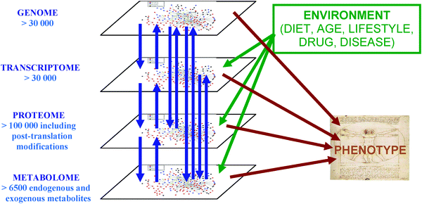
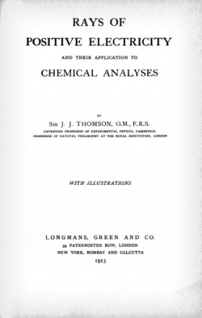
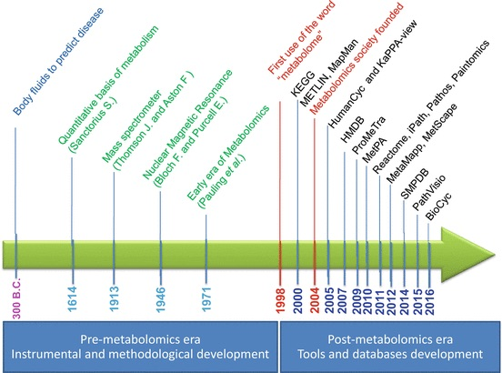

# Introduction

Biological information flows across multiple scales, from individuals to populations, communities, and ecosystems. Metabolomics, the profiling and quantification of metabolites, is a relatively new member of the omics family. Compared with other omics fields, metabolomics focuses on small molecules, typically with molecular weights below 1500 Da. Figure \@ref(fig:metaintro) illustrates the position of metabolomics within the broader omics landscape[\@b.dunn2011].

```{r metaintro, fig.show='hold', fig.cap='The complex interactions of functional levels in biological systems.',echo=FALSE,out.width='90%'}

```

Metabolomics studies commonly employ GC-MS[@theodoridis2012; @beale2018], GC\*GC-MS[@tian2016], LC-MS[@gika2014], LC-MS/MS[@begou2017], IM-MS[@levy2019], infrared ion spectroscopy[@martens2017], or NMR[\@b.dunn2011] to measure metabolites. For broader discussion of analytical methods, see[@zhang2012e], and for an overview of technical progress during 2012-2018, see[@miggiels2019]. This book focuses on mass spectrometry-based metabolomics, especially XC-MS workflows.

Exposomics extends metabolomics toward the comprehensive measurement of environmental, dietary, lifestyle, and xenobiotic exposures together with their biological responses. Because untargeted mass spectrometry is widely used in both fields, exposomics shares many analytical foundations with metabolomics, including sample preparation, feature detection, annotation, normalization, and statistical modeling. However, exposomics also introduces broader questions in exposure science, epidemiology, ethics, and causal interpretation. Therefore, this book focuses on metabolomics workflows, while exposomics is acknowledged as an important related direction beyond the present scope.

Despite its power, metabolomics has several important limitations. No single analytical platform can comprehensively measure the entire metabolome because metabolites differ widely in polarity, abundance, volatility, stability, and ionization behavior. Untargeted studies also face major challenges in confident annotation and identification, while signal intensities can be strongly affected by matrix effects, batch effects, and pre-analytical variation during sample collection, storage, and extraction. Compared with other omics fields, metabolomics usually has lower analytical throughput and higher per-sample experimental complexity, which often limits practical sample size in real studies. As a result, many metabolomics datasets are not large enough to provide stable effect size estimation or strong independent validation, making reproducibility, cross-study comparison, and causal interpretation more difficult.

## History

### History of Mass Spectrometry

For a broader historical commentary on mass spectrometry, see[@yatesiii2011]. A brief summary is given below:

-   1913, Sir Joseph John Thomson "Rays of Positive Electricity and Their Application to Chemical Analyses."

```{r history, fig.show='hold', fig.cap='Sir Joseph John Thomson "Rays of Positive Electricity and Their Application to Chemical Analyses."',echo=FALSE,out.width='90%'}

```

-   Petroleum industry bring mass spectrometry from physics to chemistry

-   The first commercial mass spectrometer is from Consolidated Engineering Corp to analysis simple gas mixtures from petroleum

-   In World War II, U.S. use mass spectrometer to separate and enrich isotopes of uranium in Manhattan Project

-   U.S. also use mass spectrometer for organic compounds during wartime and extend the application of mass spectrometer

-   1946, TOF, William E. Stephens

-   1970s, quadrupole mass analyzer

-   1970s, R. Graham Cooks developed mass-analyzed ion kinetic energy spectrometry, or MIKES to make MRM analysis for multi-stage mass spectrometry

-   1980s, MALDI rescue TOF and mass spectrometry move into biological application

-   1990s, Orbitrap mass spectrometry

-   2010s, Aperture Coding mass spectrometry

### History of Metabolomics

You could check this report[@baker2011]. According to this book section[@kusonmano2016]:

```{r history2, fig.show='hold', fig.cap='Metabolomics timeline during pre- and post-metabolomics era',echo=FALSE,out.width = '90%'}

```

-   2000-1500 BC some traditional Chinese doctors who began to evaluate the glucose level in urine of diabetic patients using ants

-   300 BC ancient Egypt and Greece that traditionally determine the urine taste to diagnose human diseases

-   1913 Joseph John Thomson and Francis William Aston mass spectrometry

-   1946 Felix Bloch and Edward Purcell Nuclear magnetic resonance

-   late 1960s chromatographic separation technique

-   1971 Pauling's research team "Quantitative Analysis of Urine Vapor and Breath by Gas--Liquid Partition Chromatography"

-   Willmitzer and his research team pioneer group in metabolomics which suggested the promotion of the metabolomics field and its potential applications from agriculture to medicine and other related areas in the biological sciences

-   2007 Human Metabolome Project consists of databases of approximately 2500 metabolites, 1200 drugs, and 3500 food components

-   post-metabolomics era high-throughput analytical techniques

### Definition

Metabolomics is actually a comprehensive analysis with identification and quantification of both known and unknown compounds in an unbiased way. Metabolic fingerprinting is working on fast classification of samples based on metabolite data without quantifying or identification of the metabolites. Metabolite profiling always need a pre-defined metabolites list to be quantification[@madsen2010].

Meanwhile, targeted and untargeted metabolomics are also used in publications. For targeted metabolomics, the majority of the molecules within a biological pathway or a defined group of related metabolites are determined. Sometimes broad collection of known metabolites could also be referred as targeted analysis. Untargeted analysis detect all of possible metabolites unbiased in the samples of interest. A similar concept called non-targeted analysis/screen is actually describe the similar studies or workflow.

## Reviews and tutorials

Some nice reviews and tutorials related to this workflow could be found in those papers or directly online:

### Workflow

Those papers are recommended[@gonzalez-riano2020; @pezzatti2020; @liu2019; @barnes2016a; @cajka2016; @gika2014; @theodoridis2012; @lu2008; @fiehn2002] for general metabolomics related topics.

-   For targeted metabolomics, you could check those reviews[@griffiths2010; @lu2008a; @weljie2006; @yuan2012; @zhou2016; @begou2017].

### Data analysis

You could firstly read those papers[@barnes2016; @kusonmano2016; @madsen2010; @uppal2016; @alonso2015] to get the concepts and issues for data analysis in metabolomics. Then this paper[@gromski2015] could be treated as a step-by-step tutorial. For GC-MS based metabolomics, check this paper[@rey-stolle2022].

-  A guide could be used choose an informatics software and tools for lipidomics[@ni2022].

-   For annotation, this paper[@domingo-almenara2018] is a well organized review.

-   For database used in metabolomics, you could check this review[@vinaixa2016].

-   For metabolomics software, check this series of reviews for each year[@misra2016; @misra2017; @misra2018].

-   For open sourced software, those reviews[@chang2021; @spicer2017; @dryden2017] could be a good start.

-   For DIA or DDA metabolomics, check those papers[@fenaille2017; @bilbao2015].

Here is the slides for metabolomics data analysis workshop and I have made presentations twice in UWaterloo and UC Irvine.

-   [Introduction](http://yufree.github.io/presentation/metabolomics/introduction#1)

-   [Statistical Analysis](http://yufree.github.io/presentation/metabolomics/StatisticalAnalysis#1)

-   [Batch Correction](http://yufree.github.io/presentation/metabolomics/BatchCorrection#1)

-   [Annotation](http://yufree.github.io/presentation/metabolomics/Annotation#1)


### Application

-   For environmental research related metabolomics or exposome, check those papers[@matich2019; @tang2020; @warth2017; @bundy2009].

-   For toxicology, check this paper[@viant2019].

-   Check this piece[@wishart2016] for drug discovery and precision medicine.

-   For food chemistry, check this paper[@castro-puyana2017], this paper for livestock[@goldansaz2017] and those papers for nutrition[@allam-ndoul2016; @jones2012; @muller2020].

-   For disease related metabolomics such as oncology[@spratlin2009], Cardiovascular[@cheng2017] . This paper[@kennedy2018] cover the metabolomics related clinical research.

-   For plant science, check those paper[@sumner2003; @jorge2016a; @hansen2018].

-   For single cell metabolomics analysis, check here[@fessenden2016; @zenobi2013; @ali2019; @hansen2018].

-   For gut microbiota, check here[@smirnov2016].

### Challenge

General challenge for metabolomics studies could be found here [@schymanski2017; @uppal2016; @schrimpe-rutledge2016; @wolfender2015].

-   For reproducible research, check those papers [@du2022; @place2021; @verhoeven2020; @mangul2019; @wallach2018; @hites2018; @considine2017; @sarpe2017]. To match data from different LC system, [M2S](https://github.com/rjdossan/M2S) could be used[@climacopinto2022].

-   Quantitative Metabolomics related issues could be found here[@kapoore2016b; @jorge2016a; @lv2022; @vitale2022].

-   For quality control issues, check here[@dudzik2018; @siskos2017; @sumner2007; @place2021;@broeckling2023;@gonzalez-dominguez2024]. You might also try postcolumn infusion as a quality control tool[@gonzalez2022].

## Trends in Metabolomics

```{r rentrez, eval=F}
library(rentrez)
papers_by_year <- function(years, search_term){
    return(sapply(years, function(y) entrez_search(db="pubmed",term=search_term, mindate=y, maxdate=y, retmax=0)$count))
}
years <- 2002:2022
total_papers <- papers_by_year(years, "")
omics <- c("genomics", "epigenomics",  "metagenomic", "proteomics", "transcriptomics","metabolomics","exposomics")
trend_data <- sapply(omics, function(t) papers_by_year(years, t))
trend_props <- trend_data/total_papers
library(reshape)
library(ggplot2)
trend_df <- melt(data.frame(years, trend_data), id.vars="years")
p <- ggplot(trend_df, aes(years, value, colour=variable))
p + geom_line(size=1) + scale_y_log10("number of papers") + theme_bw()
```

## Glossary

The following abbreviations and terms are used throughout this book:

| Abbreviation | Full Name |
|---|---|
| ANOVA | Analysis of Variance |
| APCI | Atmospheric Pressure Chemical Ionization |
| CID | Collision-Induced Dissociation |
| DBS | Dried Blood Spots |
| DDA | Data-Dependent Acquisition |
| DIA | Data-Independent Acquisition |
| DoE | Design of Experiments |
| EIC | Extracted Ion Chromatogram |
| ESI | Electrospray Ionization |
| ExWAS | Exposome-Wide Association Study |
| FDR | False Discovery Rate |
| GC-MS | Gas Chromatography-Mass Spectrometry |
| GNPS | Global Natural Products Social Molecular Networking |
| HILIC | Hydrophilic Interaction Liquid Chromatography |
| HMDB | Human Metabolome Database |
| HRMS | High-Resolution Mass Spectrometry |
| ISF | In-Source Fragmentation |
| LC-MS | Liquid Chromatography-Mass Spectrometry |
| ML/DL | Machine Learning / Deep Learning |
| MR | Mendelian Randomization |
| MRM | Multiple Reaction Monitoring |
| MS/MS (MS2) | Tandem Mass Spectrometry |
| MSI | Metabolomics Standards Initiative |
| NMR | Nuclear Magnetic Resonance |
| PCA | Principal Component Analysis |
| PLS-DA | Partial Least Squares Discriminant Analysis |
| PMD | Paired Mass Distance |
| QC | Quality Control |
| QSPR | Quantitative Structure-Property Relationship |
| ROI | Region of Interest |
| RSD | Relative Standard Deviation |
| SIL-IS | Stable Isotope-Labeled Internal Standard |
| SPME | Solid-Phase Microextraction |
| TOF | Time-of-Flight |
| UPLC | Ultra-Performance Liquid Chromatography |
| VAMS | Volumetric Absorptive Microsampling |

## Workflow

```{r, echo = F}
library(DiagrammeR)
DiagrammeR::grViz("digraph workflow {
node [shape = box]
A [label = '@@1']
B [label = '@@2']
C [label = '@@3']
D [label = '@@4']
E [label = '@@5']
F [label = '@@6']
G [label = '@@7']
H [label = '@@8']
I [label = '@@9']
J [label = '@@10']
K [label = '@@11']
L [label = '@@12']
M [label = '@@13']
N [label = '@@14']
O [label = '@@15']

A -> B -> C -> D -> E -> F -> G -> H
H -> I
I -> J
H -> J -> K -> L
L -> M -> N
L -> O
                  }

[1]: 'raw data'
[2]: 'open source format'
[3]: 'DoE folder'
[4]: 'peaks list'
[5]: 'retention time correction'
[6]: 'peaks grouping'
[7]: 'peaks filling'
[8]: 'raw peaks'
[9]: 'data visualization'
[10]: 'batch effects correction'
[11]: 'corrected peaks'
[12]: 'annotation'
[13]: 'metabolomics pathway analysis'
[14]: 'omics analysis'
[15]: 'biomarkers discovery/diagnosis'

                  ",width = 300)
```
