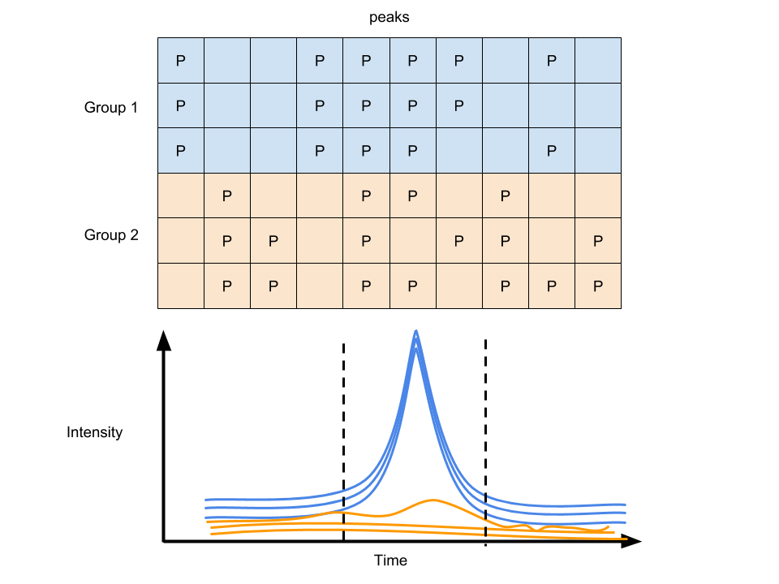

# Raw data pretreatment

Raw data from the instruments such as LC-MS or GC-MS were hard to be analyzed. To make it clear, the structure of those data could be summarized as:

-   Indexed scan with time-stamp

-   Each scan contains a full scan mass spectra

Common formats for open source mass spectrum data are mzxml, mzml or CDF. However, **MassComp** might shrink the data size[@yang2019b].

[ProteoWizard Toolkit](http://proteowizard.sourceforge.net/) provides a set of open-source, cross-platform software libraries and tools [@chambers2012]. Msconvert is one tool in this toolkit.

mzML2ISA & nmrML2ISA could generate enriched ISA-Tab metadata files from metabolomics XML data [@larralde2017].

## Data visualization

You could use [msxpertsuite](https://salsa.debian.org/debichem-team/msxpertsuite) for MS data visualization. It is biological mass spectrometry data visualization and mining with full JavaScript ability [@rusconi2019].

[FTMSVisualization](https://github.com/wkew/FTMSVisualization) is a suite of tools for visualizing complex mixture FT-MS data [@kew2017].

## Peak extraction

GC/LC-MS data are usually be shown as a matrix with column standing for retention times and row standing for masses after bin them into small cell.

```{r singledata, fig.show='hold', fig.cap='Demo of GC/LC-MS data',echo=FALSE,out.width='90%'}
knitr::include_graphics('images/singledata.png')
```

Conversation from the mass-retention time matrix into a vector with selected MS peaks at certain retention time is the basic idea of Peak extraction. You could EIC for each mass to charge ratio and use the change of trace slope to determine whether there is a peak or not. Then we could make integration for this peak and get peak area and retention time.

```{r demoeic, fig.show='hold', fig.cap='Demo of EIC with peak'}
intensity <- c(10,10,10,10,10,14,19,25,30,33,26,21,16,12,11,10,9,10,11,10)
time <- c(1:20)
plot(intensity~time, type = 'o', main = 'EIC')
```

However, due to the accuracy of instrument, the detected mass to charge ratio would have some shift and EIC would fail if different scan get the intensity from different mass to charge ratio.

In the `matchedfilter` algorithm [@smith2006], they solve this issue by bin the data in m/z dimension. The adjacent chromatographic slices could be combined to find a clean signal fitting fixed second-derivative Gaussian with full width at half-maximum (fwhm) of 30s to find peaks with about 1.5-4 times the signal peak width. The the integration is performed on the fitted area.

```{r matchedfilter, fig.show='hold', fig.cap='Demo of matchedfilter',echo=FALSE,out.width='90%'}
knitr::include_graphics('images/matchedfilter.jpg')
```

The `Centwave` algorithm [@tautenhahn2008] based on detection of regions of interest(ROI) and the following Continuous Wavelet Transform (CWT) is preferred for high-resolution mass spectrum. ROI means a region with stable mass for a certain time. When we find the ROIs, the peak shape is evaluated and ROI could be extended if needed. This algorithm use `prefilter` to accelerate the processing speed. `prefilter` with 3 and 100 means the ROI should contain 3 scan with intensity above 100. Centwave use a peak width range which should be checked on pool QC. Another important parameter is `ppm`. It is the maximum allowed deviation between scans when locating regions of interest (ROIs), which is different from vendor number and you need to extend them larger than the company claimed. For `profparam`, it's used for fill peaks or align peaks instead of peak picking. `snthr` is the cutoff of signal to noise ratio.

Deep learning frame for LC-MS feature detection on 2D pseudo color image could improve the peak picking process [@zhao2021].

## MS/MS

Various data acquisition workflow could be checked here[@fenaille2017a].

### MRM

-   [decoMS2](https://pubs.acs.org/doi/10.1021/ac400751j) An Untargeted Metabolomic Workflow to Improve Structural Characterization of Metabolites[@nikolskiy2013]. It requires two different collision energies, low (usually 0V) and high, in each precursor range to solve the mathematical equations.

-   Data-Independent Targeted Metabolomics Method could connect MS1 and MRM [@chen2017]

### DDA

The coverage of DDA could be enhanced by a feature classification strategy [@hu2019].

### DIA

DIA methods could be summarized here including MSE, stepwise windows and random windows[@bilbao2015a] and here is comparison[@zhu2014].

-   [msPurity](https://pubs.acs.org/doi/10.1021/acs.analchem.6b04358) Automated Evaluation of Precursor Ion Purity for Mass Spectrometry-Based Fragmentation in Metabolomics [@lawson2017]

-   [ULSA](https://pubs.acs.org/doi/suppl/10.1021/acs.est.8b00259/suppl_file/es8b00259_si_001.pdf) Deconvolution algorithm and a universal library search algorithm (ULSA) for the analysis of complex spectra generated via data-independent acquisition based on Matlab [@samanipour2018]

-   MS-DIAL was initially designed for DIA [@tsugawa2015b; @treutler2016a]

-   [DIA-Umpire](https://www.nature.com/articles/nmeth.3255) show a comprehensive computational framework for data-independent acquisition proteomics [@tsou2015]

-   [MetDIA](https://pubs.acs.org/doi/abs/10.1021/acs.analchem.6b02122) could perform Targeted Metabolite Extraction of Multiplexed MS/MS Spectra Generated by Data-Independent Acquisition [@li2016]

-   [MetaboDIA](https://sourceforge.net/projects/metabodia/) workflow build customized MS/MS spectral libraries using a user's own data dependent acquisition (DDA) data and to perform MS/MS-based quantification with DIA data, thus complementing conventional MS1-based quantification [@chen2017a]

-   [SWATHtoMRM](https://pubs.acs.org/doi/10.1021/acs.analchem.7b05318) Development of High-Coverage Targeted Metabolomics Method Using SWATH Technology for Biomarker Discovery[@zha2018]

-   [Skyline](https://skyline.ms/project/home/software/Skyline/begin.view) is a freely-available and open source Windows client application for building Selected Reaction Monitoring (SRM) / Multiple Reaction Monitoring (MRM), Parallel Reaction Monitoring (PRM - Targeted MS/MS), Data Independent Acquisition (DIA/SWATH) and targeted DDA with MS1 quantitative methods and analyzing the resulting mass spectrometer data [@adams2020].

-   [MSstats](https://github.com/MeenaChoi/MSstats) is an R-based/Bioconductor package for statistical relative quantification of peptides and proteins in mass spectrometry-based proteomic experiments[@choi2014a]. It is applicable to multiple types of sample preparation, including label-free workflows, workflows that use stable isotope labeled reference proteins and peptides, and work-flows that use fractionation. It is applicable to targeted Selected Reactin Monitoring(SRM), Data-Dependent Acquisiton(DDA or shotgun), and Data-Independent Acquisition(DIA or SWATH-MS). This github page is for sharing source and testing.

Other related papers could be found here to cover SWATH and other topic in DIA[@bonner2018; @wang2019]

## Retention Time Correction

For single file, we could get peaks. However, we should make the peaks align across samples for as features and retention time corrections should be performed. The basic idea behind retention time correction is that use the high quality grouped peaks to make a new retention time. You might choose `obiwarp`(for dramatic shifts) or loess regression(fast) method to get the corrected retention time for all of the samples. Remember the original retention times might be changed and you might need cross-correct the data. After the correction, you could group the peaks again for a better cross-sample peaks list. However, if you directly use `obiwarp`, you don't have to group peaks before correction.

This paper show a matlab based shift correction methods[@fu2017]. Retention time correction is a Parametric time warping process and this paper is a good start [@wehrens2015]. Meanwhile, you could use MS2 for retention time correction[@li2017].

## Filling missing values

Too many zeros or NA in peaks list are problematic for statistics. Then we usually need to integreate the area exsiting a peak. `xcms 3` could use profile matrix to fill the blank. They also have function to impute the NA data by replace missing values with a proportion of the row minimum or random numbers based on the row minimum. It depends on the user to select imputation methods as well as control the minimum fraction of features appeared in single group.

```{r peakfilling, fig.show='hold', echo=FALSE,out.width= '90%', fig.cap='Peak filling of GC/LC-MS data',}

```

With many groups of samples, you will get another data matrix with column standing for peaks at certain retention time and row standing for samples after the Raw data pretreatment.

```{r multidata, fig.show='hold', fig.cap='Demo of many GC/LC-MS data',echo=FALSE,out.width='90%'}
knitr::include_graphics('images/multidata.png')
```

## Spectral deconvolution

Without structure information about certain compound, the peak extraction would suffer influence from other compounds. At the same retention time, co-elute compounds might share similar mass. Hard electron ionization methods such as electron impact ionization (EI), APPI suffer this issue. So it would be hard to distinguish the co-elute peaks' origin and deconvolution method[] could be used to separate different groups according to the similar chromatogragh behaviors. Another computational tool **eRah** could be a better solution for the whole process[@domingo-almenara2016]. Also the **ADAD-GC3.0** could also be helpful for such issue[@ni2016]. Other solutions for GC could be found here[@styczynski2007a; @tian2016b; @du2013a].

## Dynamic Range

Another issue is the Dynamic Range. For metabolomics, peaks could be below the detection limit or over the detection limit. Such Dynamic range issues might raise the loss of information.

### Non-detects

Some of the data were limited by the detect of limitation. Thus we need some methods to impute the data if we don't want to lose information by deleting the NA or 0.

Two major imputation way could be used. The first way is use model-free method such as half the minimum of the values across the data, 0, 1, mean/median across the data( `enviGCMS` package could do this via `getimputation` function). The second way is use model-based method such as linear model, random forest, KNN, PCA. Try `simputation` package for various imputation methods. As mentioned before, you could also use `imputeRowMin` or `imputeRowMinRand` within `xcms` package to perform imputation.

Tobit regression is preferred for censored data. Also you might choose maximum likelihood estimation(Estimation of mean and standard deviation by MLE. Creating 10 complete samples. Pool the results from 10 individual analyses).

```{r tobit,cache=TRUE}
x <- rnorm(1000,1)
x[x<0] <- 0
y <- x*10+1
library(AER)
tfit <- tobit(y ~ x, left = 0)
summary(tfit)
```

According to Ronald Hites's simulation[@hites2019], measurements below the LOD (even missing measurements) with the LOD/2 or with the $LOD/\sqrt2$ causes little bias and "Any time you have a % non-detected \>20%, for whatever reason, it is unlikely that the data set can give useful results."

Another study find random forest could be the best imputation method for missing at random (MAR), and missing completely at random (MCAR) data. Quantile regression imputation of left-censored data is the best imputation methods for left-censored missing not at random data [@wei2018].

### Over Detection Limit

**CorrectOverloadedPeaks** could be used to correct the Peaks Exceeding the Detection Limit issue [@lisec2016].

## RSD/fold change Filter

Some peaks need to be rule out due to high RSD% and small fold changes compared with blank samples.

## Power Analysis Filter

As shown in [Exprimental design(DoE)], the power analysis in metabolomics is ad-hoc since you don't know too much before you perform the experiment. However, we could perform power analysis after the experiment done. That is, we just rule out the peaks with a lower power for current experimental design.
